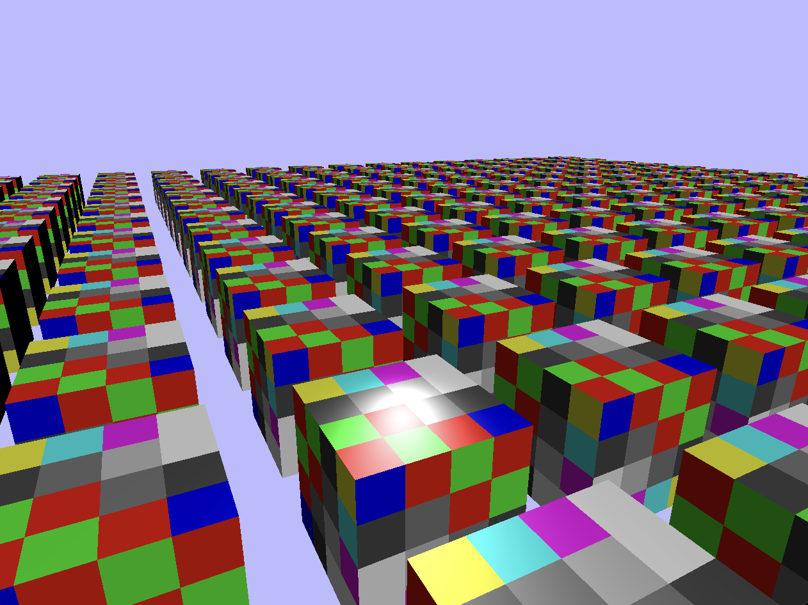

# experiments in webgpu using python (wgpu-py)

blinn-phong lit instanced, textured cubes with per vertex normals, nearest neighbour sampling and depth buffer

instanced, textured cubes with nearest neighbour sampling and depth buffer

instanced cubes with depth buffer

